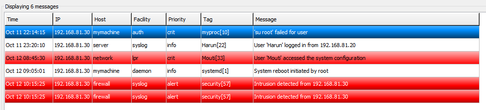
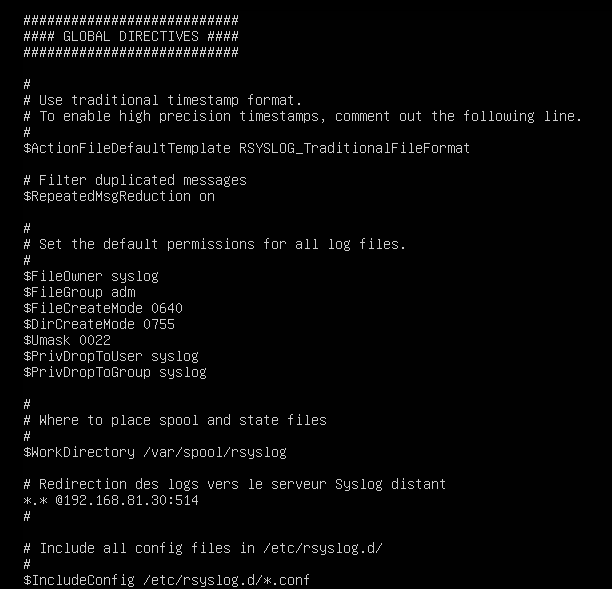
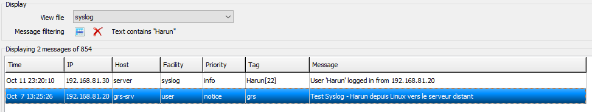
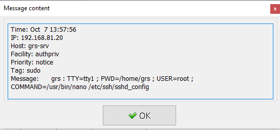
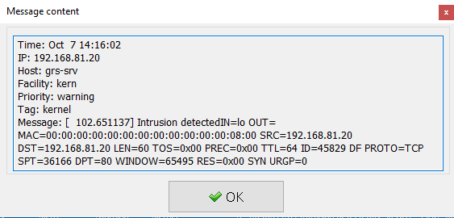
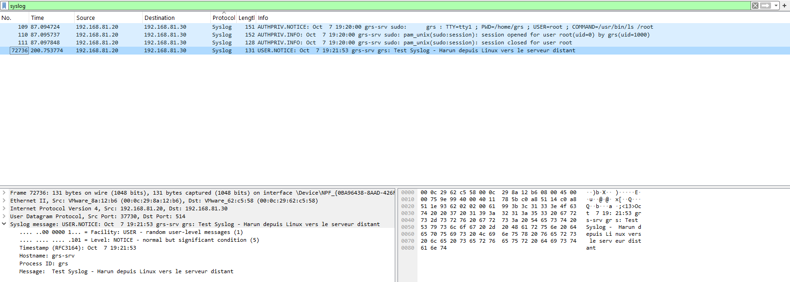
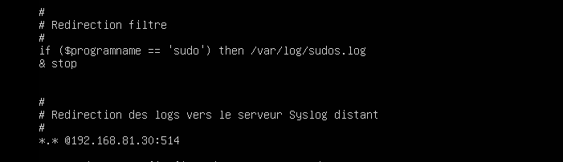
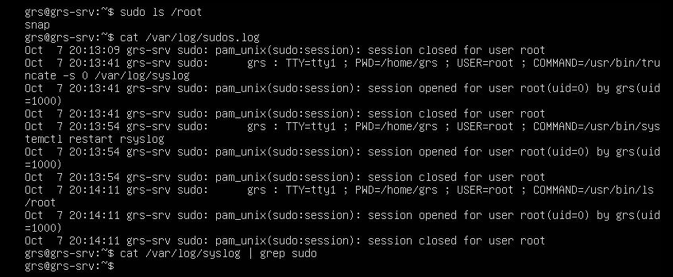
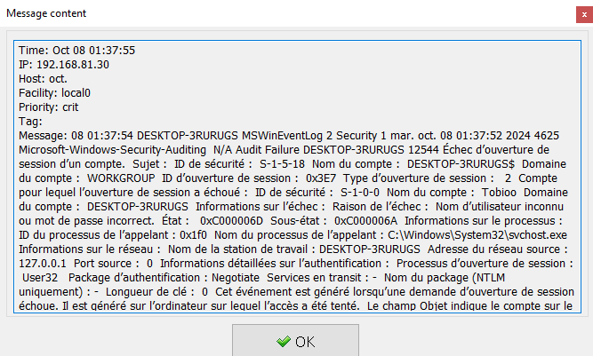

# Rapport du Laboratoire Syslog

**Projet** : Gestion des réseaux et sécurité opérationnelle (GRS)  
**Auteurs** : Amir Mouti, Ouweis Harun  
**Infrastructure** :  

- Nœud 1 : Linux Ubuntu 22.04 (IP: 192.168.81.20)  
- Nœud 2 : Routeur Cisco ISR1000 (IP: 192.168.81.10)  
- Nœud 3 : Windows 10 (IP: 192.168.81.30)

## Objectifs du laboratoire

1. Configurer un serveur et des clients Syslog.
2. Configurer Syslog sur des composants du réseau.
3. Rediriger les événements Windows sur un serveur Syslog.

---

- [Rapport du Laboratoire Syslog](#rapport-du-laboratoire-syslog)
  - [Objectifs du laboratoire](#objectifs-du-laboratoire)
  - [1. Configuration du serveur Syslog sur Windows 10](#1-configuration-du-serveur-syslog-sur-windows-10)
    - [1.1 Démarrage du serveur Syslog](#11-démarrage-du-serveur-syslog)
      - [1.1.1 Capture d’écran des événements reçus (Livrable 1)](#111-capture-décran-des-événements-reçus-livrable-1)
  - [2. Configuration du client Syslog sur Linux](#2-configuration-du-client-syslog-sur-linux)
    - [2.1 Modification du fichier de configuration rsyslog](#21-modification-du-fichier-de-configuration-rsyslog)
      - [2.1.1 Affichage du fichier de configuration (Livrable 2)](#211-affichage-du-fichier-de-configuration-livrable-2)
    - [2.2 Génération de messages depuis Linux](#22-génération-de-messages-depuis-linux)
      - [2.2.1 Messages reçus sur le serveur Syslog distant (Livrable 3)](#221-messages-reçus-sur-le-serveur-syslog-distant-livrable-3)
      - [2.2.2 Exemples de messages utiles pour la gestion des réseaux (Livrable 4)](#222-exemples-de-messages-utiles-pour-la-gestion-des-réseaux-livrable-4)
      - [2.2.3 Analyse de la sécurité des échanges Syslog (Livrable 5)](#223-analyse-de-la-sécurité-des-échanges-syslog-livrable-5)
    - [2.3 Analyse de la capture Wireshark](#23-analyse-de-la-capture-wireshark)
      - [2.3.1 Présentation et explication de la capture Wireshark (Livrable 6)](#231-présentation-et-explication-de-la-capture-wireshark-livrable-6)
    - [2.4 Filtrage des messages sudo](#24-filtrage-des-messages-sudo)
      - [2.4.1 Configuration pour les messages sudo (Livrable 7)](#241-configuration-pour-les-messages-sudo-livrable-7)
  - [3. Configuration du routeur Cisco pour envoyer des logs Syslog](#3-configuration-du-routeur-cisco-pour-envoyer-des-logs-syslog)
    - [3.1 Configuration des logs de niveau Debug](#31-configuration-des-logs-de-niveau-debug)
      - [3.1.1 Commandes IOS utilisées (Livrable 8)](#311-commandes-ios-utilisées-livrable-8)
    - [3.2 Configuration NTP pour une précision à la milliseconde](#32-configuration-ntp-pour-une-précision-à-la-milliseconde)
      - [3.2.1 Commandes IOS pour NTP (Livrable 9)](#321-commandes-ios-pour-ntp-livrable-9)
    - [3.3 Log de modification de configuration](#33-log-de-modification-de-configuration)
      - [3.3.1 Commandes IOS pour les logs de modification (Livrable 10)](#331-commandes-ios-pour-les-logs-de-modification-livrable-10)
      - [3.3.2 Message reçu sur le serveur Syslog (Livrable 11)](#332-message-reçu-sur-le-serveur-syslog-livrable-11)
  - [4. Redirection des événements Windows vers le serveur Syslog](#4-redirection-des-événements-windows-vers-le-serveur-syslog)
    - [4.1 Envoi de messages Syslog avec logger.exe](#41-envoi-de-messages-syslog-avec-loggerexe)
      - [4.1.1 Commande et message reçu (Livrable 12)](#411-commande-et-message-reçu-livrable-12)
    - [4.2 Envoi de messages Syslog avec PowerShell (RFC 3164 et RFC 5424)](#42-envoi-de-messages-syslog-avec-powershell-rfc-3164-et-rfc-5424)
      - [4.2.1 Commandes PowerShell et messages reçus (Livrable 13)](#421-commandes-powershell-et-messages-reçus-livrable-13)
    - [4.3 Script PowerShell pour vérification des processus](#43-script-powershell-pour-vérification-des-processus)
      - [4.3.1 Contenu du script et message reçu (Livrable 14)](#431-contenu-du-script-et-message-reçu-livrable-14)
    - [4.4 Redirection des événements d’échec de login](#44-redirection-des-événements-déchec-de-login)
      - [4.4.1 Fonctionnement de la redirection avec une capture d’écran (Livrable 15)](#441-fonctionnement-de-la-redirection-avec-une-capture-décran-livrable-15)
  - [5. Utilisation de Sysmon sur Windows 10](#5-utilisation-de-sysmon-sur-windows-10)
    - [5.1 Fichier de configuration XML de Sysmon](#51-fichier-de-configuration-xml-de-sysmon)
      - [5.1.1 Contenu du fichier XML Sysmon (Livrable 16)](#511-contenu-du-fichier-xml-sysmon-livrable-16)
    - [5.2 Capture des événements dans l’Observateur d’événements](#52-capture-des-événements-dans-lobservateur-dévénements)
      - [5.2.1 Capture d’écran des événements dans l’Observateur (Livrable 17)](#521-capture-décran-des-événements-dans-lobservateur-livrable-17)

---

## 1. Configuration du serveur Syslog sur Windows 10

### 1.1 Démarrage du serveur Syslog

- Démarrage de Visual Syslog Server.
- Test à l’aide de **SyslogGenerator** pour générer et vérifier les messages reçus.

#### 1.1.1 Capture d’écran des événements reçus (Livrable 1)

Les messages générés ont été correctement reçus par le serveur Syslog (Visual Syslog Server) sur le nœud Windows 10. La capture d'écran suivante montre les messages qui ont été envoyés et reçus, y compris ceux avec les noms "Harun" et "Mouti".



---

## 2. Configuration du client Syslog sur Linux

### 2.1 Modification du fichier de configuration rsyslog

- Configuration du fichier `/etc/rsyslog.conf` pour rediriger les logs vers le serveur Syslog situé sur Windows 10.

#### 2.1.1 Affichage du fichier de configuration (Livrable 2)  

voici le contenu du fichier `/etc/rsyslog.conf` après modification pour rediriger les logs vers le serveur Syslog sur Windows 10.



Comme la photo le montre nous avons ajouté la ligne suivante à la fin du fichier de configuration `*.* @192.168.81.30:514`

Ne pas oublier de faire un `sudo systemctl restart rsyslog` pour appliquer les changements.

### 2.2 Génération de messages depuis Linux

- Utilisation de commandes comme `sudo reboot`, `sudo ls /root` et `logger "Test Syslog - Harun depuis Linux vers le serveur distant"`.

#### 2.2.1 Messages reçus sur le serveur Syslog distant (Livrable 3)  

- reboot 
- sudo 
- logger 


#### 2.2.2 Exemples de messages utiles pour la gestion des réseaux (Livrable 4)  

- **Erreurs de connexion** : Ces messages permettent d’identifier rapidement les problèmes de sécurité ou d'accès utilisateur.


- **Modifications de configuration** : Ils permettent de tracer les changements effectués sur des équipements ou des serveurs pour faciliter le dépannage.




- **Redémarrages** : Ces logs permettent de suivre les redémarrages des systèmes ou équipements pour diagnostiquer des interruptions.


- **Tentatives d’accès suspectes** : Les logs relatifs aux intrusions ou aux accès non autorisés sont cruciaux pour renforcer la sécurité réseau.

après avoir fait `sudo iptables -A INPUT -p tcp --dport 80 -j LOG --log-prefix "Intrusion detected: "`, on a pu voir les logs suivant lors d'une tentative de ping depuis la machine windows a la machine linux.



#### 2.2.3 Analyse de la sécurité des échanges Syslog (Livrable 5)  

Le protocole **Syslog**, tel que défini par le **RFC 3164**, utilise par défaut le port **UDP 514**, ce qui signifie que les messages sont envoyés en clair, sans chiffrement ni mécanisme de contrôle d'intégrité. Cela les rend vulnérables à des interceptions et à des altérations par des attaquants. Il est donc possible de réaliser une attaque de type "man-in-the-middle" ou de falsifier des logs, compromettant la fiabilité des informations envoyées. Pour améliorer la sécurité, il est recommandé d'utiliser des versions sécurisées de Syslog, comme **Syslog sur TCP** ou **Syslog over TLS** (chiffrement).

### 2.3 Analyse de la capture Wireshark

#### 2.3.1 Présentation et explication de la capture Wireshark (Livrable 6)  

La capture montre un paquet **Syslog** envoyé depuis le nœud Linux (192.168.81.20) vers le serveur Syslog sur Windows (192.168.81.30) via le port **UDP 514**, conformément au standard **RFC 3164**. Le message est classé avec la **Facility USER** et un niveau de **NOTICE**, ce qui indique qu'il s'agit d'un message utilisateur important mais non critique.

Les détails du message incluent :

- **Source** : 192.168.81.20 (Linux)
- **Destination** : 192.168.81.30 (Windows)
- **Message** : "Test Syslog - Harun depuis Linux vers le serveur distant"
- **Timestamp** : Oct 7 19:21:53 (heure du système émetteur)
- **Processus** : `grs-srv`, généré par l'utilisateur Harun sur la machine Linux

L'analyse montre que les messages Syslog sont envoyés en clair via UDP, conformément au **RFC 3164**, ce qui signifie qu'ils ne sont ni chiffrés ni vérifiés, les rendant potentiellement vulnérables à des interceptions.



### 2.4 Filtrage des messages sudo

- Modification du fichier pour rediriger uniquement les messages `sudo` vers `/var/log/sudos.log`.

#### 2.4.1 Configuration pour les messages sudo (Livrable 7)  



Cette capture montre la configuration dans /etc/rsyslog.conf, où les logs générés par sudo sont redirigés vers /var/log/sudos.log, grâce à la règle

 ```bash
    if $programname == 'sudo' then /var/log/sudos.log
    & stop 
```



Les commandes sudo exécutées apparaissent correctement dans /var/log/sudos.log, et la commande grep sudo confirme que les logs sudo ne sont plus dans /var/log/syslog.

---

## 3. Configuration du routeur Cisco pour envoyer des logs Syslog

### 3.1 Configuration des logs de niveau Debug

- Configuration du routeur pour envoyer des logs de niveau Debug sur le serveur Syslog en tant que **Local_3**.

#### 3.1.1 Commandes IOS utilisées (Livrable 8)  

```bash
    en
    conf t
    logging host 192.168.81.30 transport udp port 514
    logging on
    logging facility local3
    logging trap debugging
```

### 3.2 Configuration NTP pour une précision à la milliseconde

#### 3.2.1 Commandes IOS pour NTP (Livrable 9)  

notre horloge était déjà synchronisée avec le serveur NTP, donc nous n'avons pas eu besoin de faire de changements. J'ai lu que c'était normal dans la documentation Cisco, car les routeurs  sont synchronisés avec le serveur NTP par défaut.

Mais si nous devions faire les commandes pour synchroniser l'horloge avec le serveur NTP, voici les commandes à utiliser :

```bash
    en
    conf t
    ntp server ch.pool.ntp.org
```

Pour activer l'horloge à la milliseconde, nous devons utiliser la commande suivante :

```bash
    en
    conf t
    service timestamps log datetime msec
```

### 3.3 Log de modification de configuration

- Configuration du routeur pour enregistrer les commandes lors des modifications de configuration.

#### 3.3.1 Commandes IOS pour les logs de modification (Livrable 10)  

```bash
    en
    conf t
    logging trap warnings
    archive
    log config
    logging enable
    notify syslog

```

#### 3.3.2 Message reçu sur le serveur Syslog (Livrable 11)

On peut voir que le message a été reçu par le serveur Syslog, et qu'il contient les informations sur la modification de la configuration de l'interface.


---

## 4. Redirection des événements Windows vers le serveur Syslog

### 4.1 Envoi de messages Syslog avec logger.exe

- Envoi d’un message Syslog à l’aide de la commande `logger.exe`.

#### 4.1.1 Commande et message reçu (Livrable 12)  

```bash
logger.exe -p local3.info "Test Syslog - Message depuis Windows 10"
```


### 4.2 Envoi de messages Syslog avec PowerShell (RFC 3164 et RFC 5424)

- Comparaison des messages envoyés via PowerShell en modes RFC 3164 et RFC 5424.

#### 4.2.1 Commandes PowerShell et messages reçus (Livrable 13)  


```bash
Send-SyslogMessage -Server 192.168.81.30 -Message "Message avec la RFC 5424" -Facility local0 -Severity Informational
Send-SyslogMessage -Server 192.168.81.30 -Message "Message avec la RFC 3164" -RFC3164 -Facility local0 -Severity Informational
```


RFC 5424 : Ce format est plus détaillé, incluant les millisecondes dans l'horodatage, le fuseau horaire et des métadonnées comme le processus générateur (PowerShell) et son PID. Cela permet une meilleure traçabilité des événements.

RFC 3164 : Format plus simple avec un horodatage sans millisecondes ni fuseau horaire. Il ne fournit pas de détails supplémentaires comme le processus d'origine ou le PID, mais est plus léger.

### 4.3 Script PowerShell pour vérification des processus

- Création d’un script PowerShell qui vérifie toutes les 2 minutes la présence d’un processus et envoie un message Syslog en cas d’absence.

#### 4.3.1 Contenu du script et message reçu (Livrable 14)  

```bash
while ($true) {
    # Vérifie si le processus 'cmd.exe' est en cours d'exécution
    $process = Get-Process -Name "cmd" -ErrorAction SilentlyContinue

    if (-not $process) {
        # Si le processus n'est pas trouvé, envoie un message Syslog
        Send-SyslogMessage -Server 192.168.81.30 -Message "Le processus cmd.exe est introuvable sur le système." -Facility local0 -Severity Warning
    }
    
    # Attendre 2 minutes avant de recommencer
    Start-Sleep -Seconds 120
}

```


### 4.4 Redirection des événements d’échec de login

- Redirection des événements d’échec de login via **Event Log Forwarder** ou **Send-SyslogMessage**.

#### 4.4.1 Fonctionnement de la redirection avec une capture d’écran (Livrable 15)  

L'événement d'ID 4625 a été capturé et redirigé vers le serveur Syslog (IP : 192.168.81.30). Cet événement correspond à un échec de tentative de connexion, généré lorsque le nom d'utilisateur ou le mot de passe est incorrect.

Le message détaillé indique l'adresse IP de la machine qui a tenté l'accès, le nom de l'utilisateur échoué, ainsi que les raisons précises de l'échec (dans ce cas, un mot de passe incorrect). Ce log a été correctement reçu et visualisé dans Visual Syslog Server, confirmant que la redirection des événements de sécurité est fonctionnelle.



---

## 5. Utilisation de Sysmon sur Windows 10

### 5.1 Fichier de configuration XML de Sysmon

- Configuration de Sysmon pour journaliser les connexions vers le port 80 et les requêtes DNS vers **lematin.ch**.

#### 5.1.1 Contenu du fichier XML Sysmon (Livrable 16)  

```xml
<Sysmon schemaversion="4.90">
  <EventFiltering>
    <!-- Capture des connexions réseau vers le port 80 -->
    <NetworkConnect onmatch="include">
      <DestinationPort condition="is">80</DestinationPort>
    </NetworkConnect>

    <!-- Capture des requêtes DNS vers lematin.ch -->
    <DnsQuery onmatch="include">
      <QueryName condition="contains">lematin.ch</QueryName>
    </DnsQuery>
  </EventFiltering>
</Sysmon>

```

### 5.2 Capture des événements dans l’Observateur d’événements

#### 5.2.1 Capture d’écran des événements dans l’Observateur (Livrable 17)  

Utilisation du port 80 avec pid 3 :

```bash
Network connection detected:
RuleName: -
UtcTime: 2024-10-08 00:02:01.278
ProcessGuid: {f49599a8-7679-6704-4803-000000000500}
ProcessId: 8620
Image: C:\Windows\System32\curl.exe
User: DESKTOP-3RURUGS\Tobioo
Protocol: tcp
Initiated: true
SourceIsIpv6: false
SourceIp: 192.168.81.30
SourceHostname: DESKTOP-3RURUGS
SourcePort: 50510
SourcePortName: -
DestinationIsIpv6: false
DestinationIp: 108.139.243.38
DestinationHostname: server-108-139-243-38.mxp63.r.cloudfront.net
DestinationPort: 80
DestinationPortName: http
```

Utilisation de DNS avec pid 22 :

```bash
Dns query:
RuleName: -
UtcTime: 2024-10-08 00:02:01.248
ProcessGuid: {f49599a8-7679-6704-4803-000000000500}
ProcessId: 8620
QueryName: lematin.ch
QueryStatus: 0
QueryResults: ::ffff:108.139.243.38;::ffff:108.139.243.7;::ffff:108.139.243.29;::ffff:108.139.243.33;
Image: C:\Windows\System32\curl.exe
User: DESKTOP-3RURUGS\Tobioo
```
