# 1

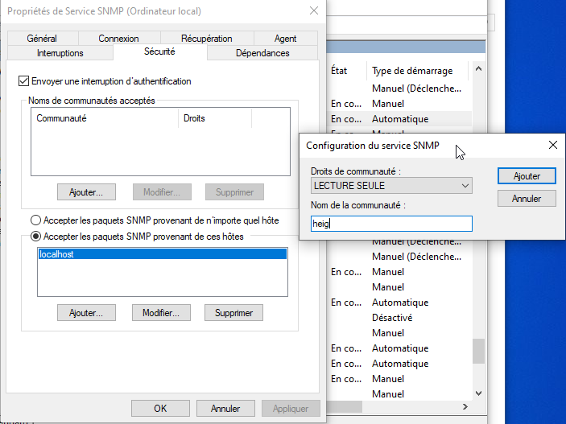

# 2 @TODO

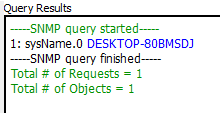
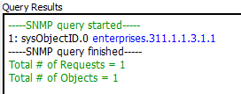
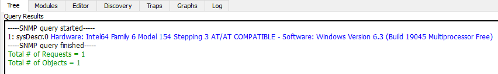
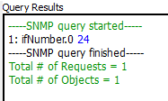
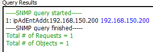

# 3 

```
enable
configure terminal
snmp-server community ciscoRO RO
snmp-server community ciscoRW RW
snmp-server host 192.168.150.200 version 2c ciscoRO
snmp-server enable traps
ntp server 192.168.150.200
service timestamps debug datetime msec
service timestamps log datetime msec

end
write memory
```

# 4 @TODO


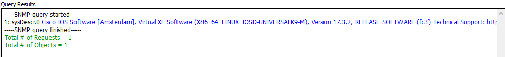

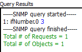


# 6


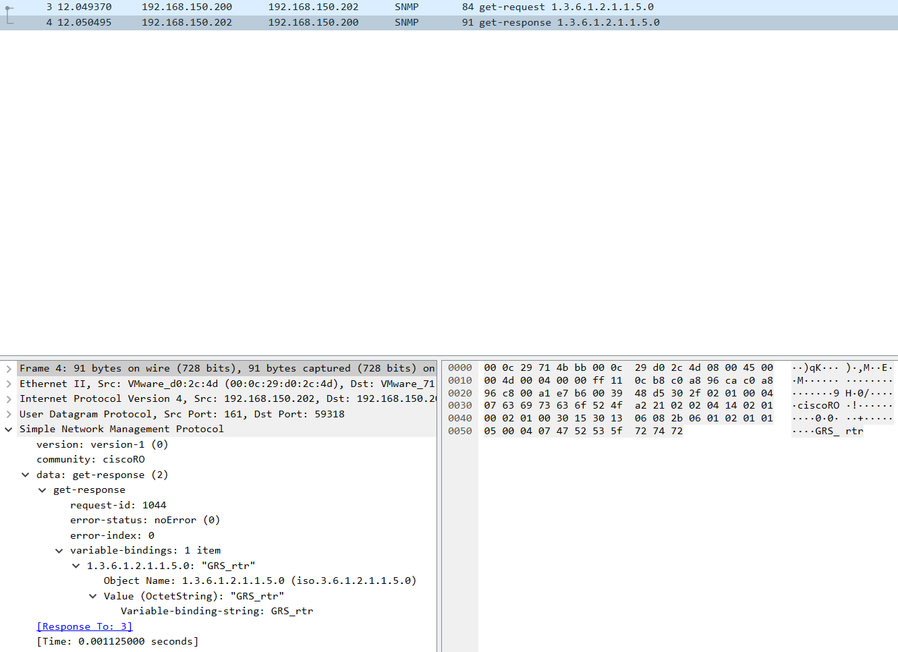

# 7

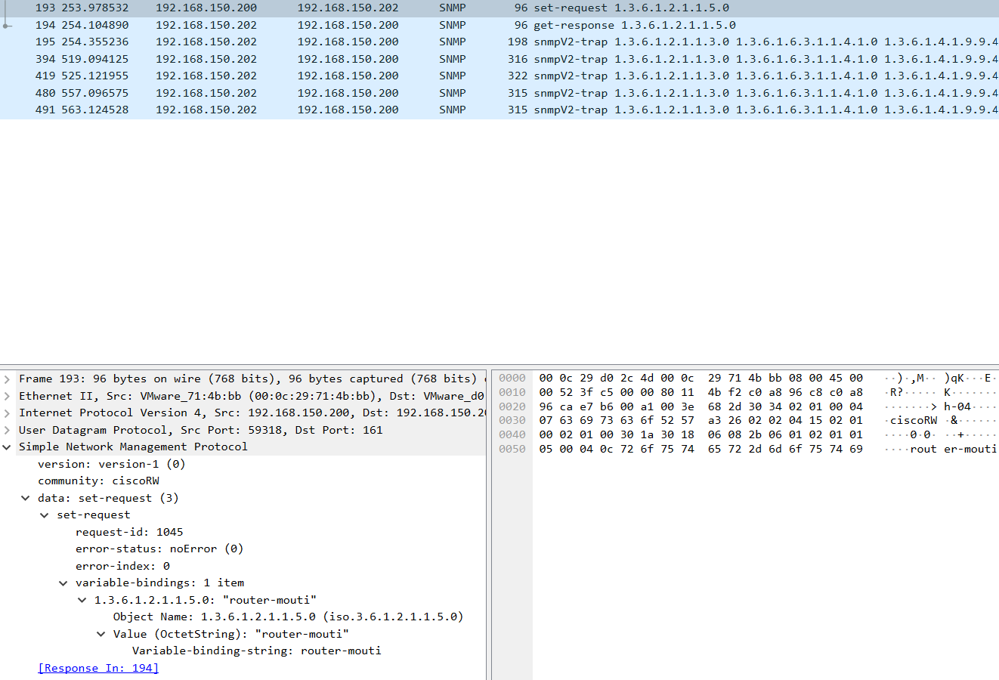


# 8

```
test snmp trap config
```

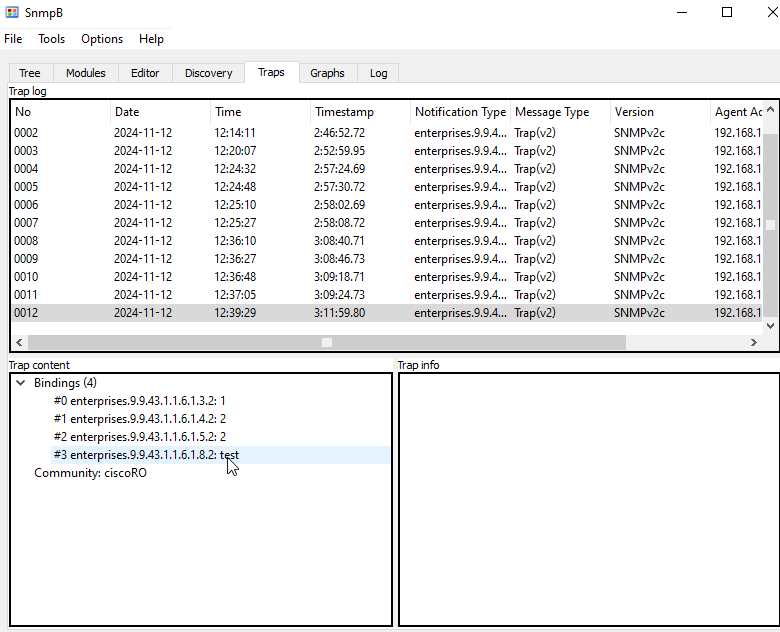

# 9

La trap config a 4 bindings:

On trouve le code OID dans la colone notification type. Il faut traduire le préfixe enterprises par 1.3.6.1.4.1

### 1.3.6.1.4.1.9.9.43.1.1.6.1.3
**ccmHistoryEventCommandSource**

C'est la source de la commande qui a déclenché l'événement. Si la valeur vaut 1, c'est commandLine et si elle vaut 2, c'est snmp

### 1.3.6.1.4.1.9.9.43.1.1.6.1.4
**ccmHistoryEventConfigSource**

La source de la config data de l'événement

### 1.3.6.1.4.1.9.9.43.1.1.6.1.5
**ccmHistoryEventConfigDestination**

La destination de la config data de l'événement

### 1.3.6.1.4.1.9.9.43.1.1.6.1.8
**ccmHistoryEventTerminalUser**

Si la valeur de ccmHistoryEventCommandSource est commandLine, c'est le nom de l'utilisateur qui est logged in

# 10


ip access-list standard SNMP_ACCESS

# 11

sudo apt install snmp snmpd
sudo nano /etc/snmp/snmpd.conf

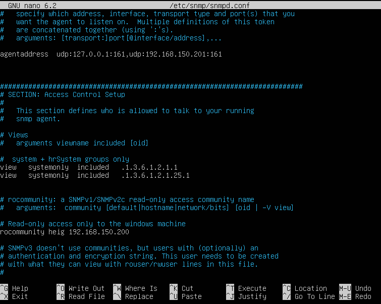

sudo ufw allow snmp
sudo systemctl restart snmpd

# 12

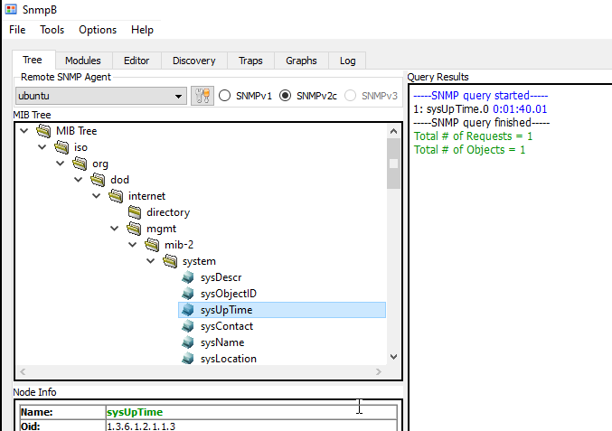

# 13

On installe Net-SNMP pour windows.

Ensuite, on peut faire cette commande pour récupérer le nom du routeur:

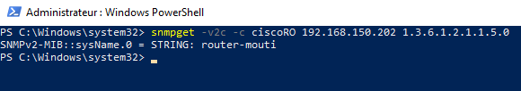

# 14 

```PowerShell
# Paramètres
$community = "heig"
$targetIP = "127.0.0.1"  # Adresse IP de la machine Windows
$oidProcesses = "1.3.6.1.2.1.25.4.2.1.2"  # hrSWRunName

# Boucle infinie pour récupérer les processus toutes les minutes
while ($true) {
    # Exécuter la commande snmpwalk pour obtenir la liste des processus
    $result = snmpwalk -v2c -c $community $targetIP $oidProcesses

    # Afficher le résultat
    Write-Host "Liste des processus actifs à $(Get-Date):"
    Write-Host $result

    # Attendre 60 secondes avant la prochaine exécution
    Start-Sleep -Seconds 60
}
```

# 15

On a chargé:
CISCO-FLASH-MIB
CISCO-SMI
CISCO-QOS-PIB-MIB

Tout d'abord, on a demandé à ChatGPT quelle MIB était nécessaire pour demander des informations sur la mémoire flash embarquée sur un routeur cisco csr1000v et il a répondu CISCO-FLASH-MIB. Ensuite, on la^'a chargé et en vérifiant la syntaxe du MIB, on voit qu'il y a des erreurs car il lui faut CISCO-SMI et CISCO-QOS-PIB-MIB.

# 16

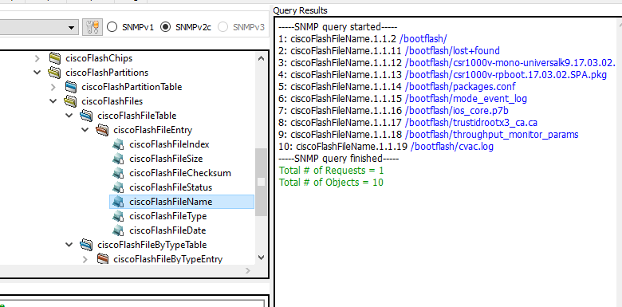

# 17


On enlève d'abord la config v2:

```
no snmp-server community ciscoRO
no snmp-server community ciscoRW
no snmp-server host 192.168.150.200 version 2c ciscoRO
```
Ensuite on peut faire la config v3:
```
! Créer un groupe SNMPv3 avec des droits en lecture seule
snmp-server group v3group v3 priv

! Créer un utilisateur avec authentification et chiffrement
snmp-server user v3user v3group v3 auth sha authpwd priv aes 128 privpwd
```

# 18


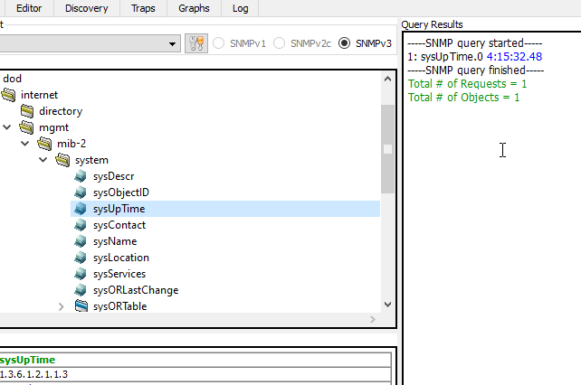

# 19

On voit quatre paquets qui sont échangés. Dans tous les paquets, on voit msgVersion: snmpv3 qui indique la version de snmp. Les deux premiers paquets ne sont pas authentifiés ni chiffrés.


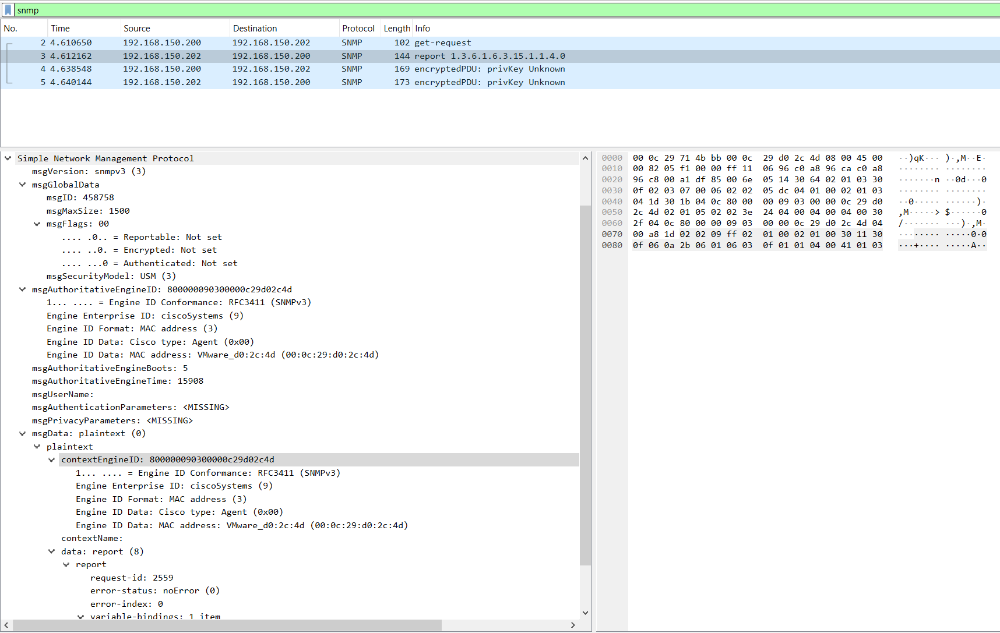

Ces deux paquets ne sont pas chiffrés: msgFlags Encrypted et Authenticated sont not set et msgAuthenticationParameters et msgPrivacyParameters sont vide.

On voit que la première requête a le champ msgAuthoritativeEngineID vide et que la réponse report lui a ce champ rempli. Ce premier échange sert à SNMPb à récupérer l'Engine ID qu'il va ensuite utiliser pour faire la vraie requête snmp qui elle est chiffrée et authentifiée:

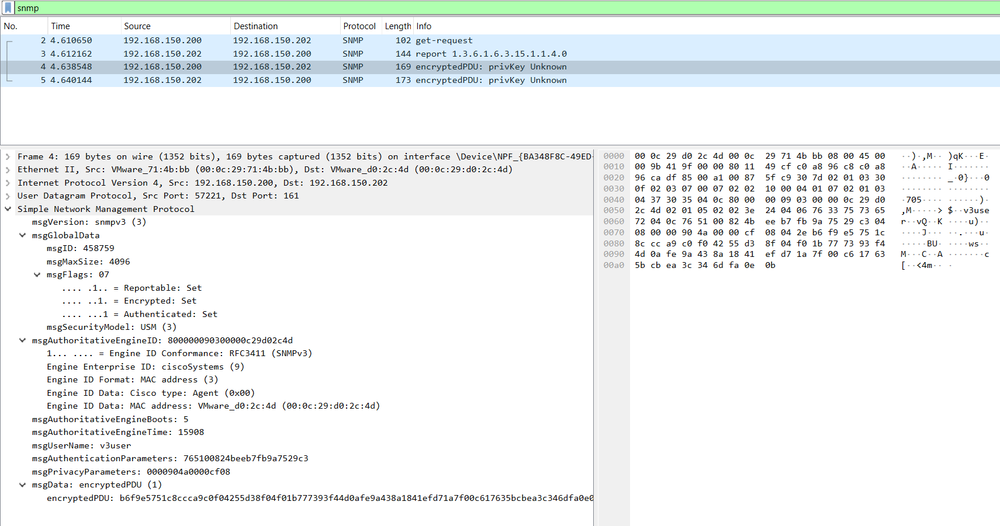
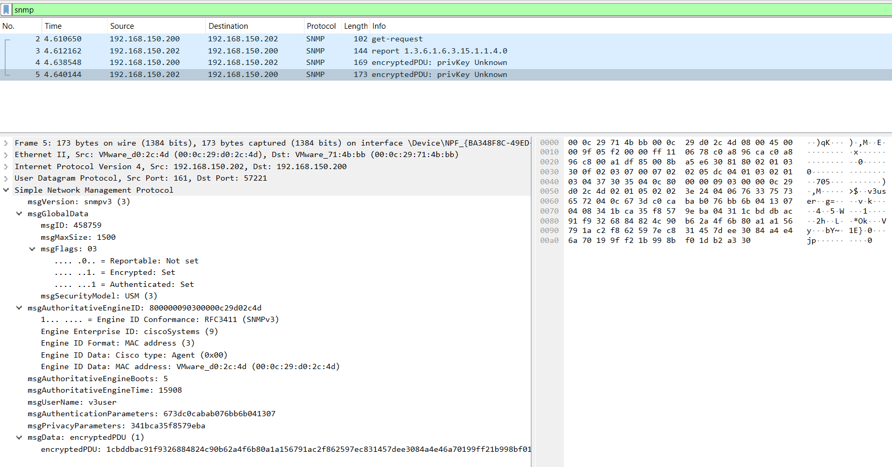

Ici les flags Encrypted et Authenticated sont set et les messages utilisent l'engine ID correcte. Le premier paquet est le get-request pour le sysUpTime et le deuxième est la réponse. On ne voit pas le contenu des paquets car ils sont chiffrés: msgData contient un encryptedPDU avec la requête et la réponse chiffrées.

# 20

# 21


