# Rapport du Laboratoire SNMP et WMI

**Projet** : Gestion des réseaux et sécurité opérationnelle (GRS)  
**Auteurs** : Amir Mouti, Ouweis Harun  
**Infrastructure** :  

Pour Ouweis :

- Nœud 1 : Linux Ubuntu 22.04 (IP: 192.168.81.20)  
- Nœud 2 : Routeur Cisco ISR1000 (IP: 192.168.81.10)  
- Nœud 3 : Windows 10 (IP: 192.168.81.30)

Pour Amir :

- Nœud 1 : Linux Ubuntu 22.04 (IP: 192.168.150.201)  
- Nœud 2 : Routeur Cisco ISR1000 (IP: 192.168.150.202)  
- Nœud 3 : Windows 10 (IP: 192.168.150.200)

## Objectifs du laboratoire

1. Configurer l’adressage des équipements.
2. Configurer un SNMP Manager.
3. Configurer des SNMP Agents.
4. Récupérer des informations sur les équipements.
5. Récupérer des alarmes.
6. Observer le trafic SNMP.
7. Utiliser WMI et écrire un script de surveillance.

---

### Objectif 1 : Configuration du réseau virtuel

- **1.1 Vérification de la connectivité des nœuds**
  - Nous avons d'abord vérifié que tous les pings fonctionnaient entre les trois nœuds.
  - 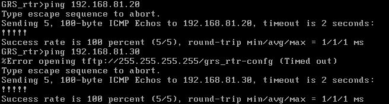
  - 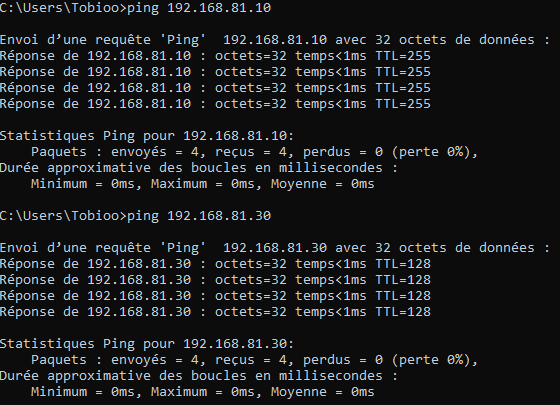
  - 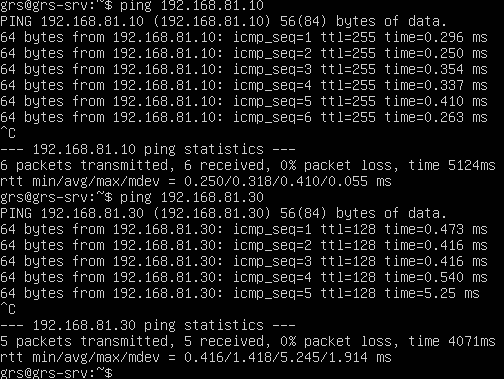

---

### Objectif 2 : Configuration du SNMP Manager

---

### Objectif 3 : Configuration des agents SNMP

- **3.1 Activation et configuration de l'agent SNMP sur Windows 10**

  - **Livrable 1 :** Montrez à l’aide de captures d’écran les changements de configuration que vous avez réalisés.

  Nous avons installé les services SNMP en allant dans les fonctionnalités facultatives de Windows 10 et en cochant les cases `Fournisseur SNMP WMI` et `Protocole SNMP (Simple Network Managment Protocol)`.

  - Une fois installé, nous avons accédé aux propriétés du service SNMP et configuré les paramètres suivants :
    - **Community string** : `heig` (en mode **Lecture seule**).
  
  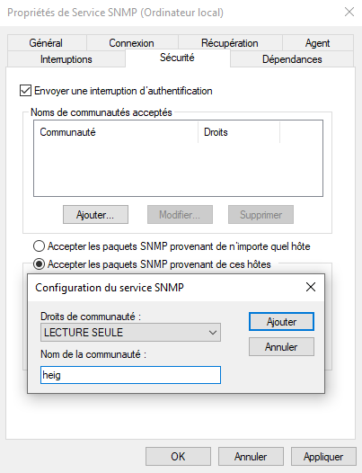
  
  - **Livrable 2 :** Montrez les valeurs retournées par les 5 objets SysDescr, SysName, SysUpTime, ifNumber, et l’adresse IP de votre cible. Vérifiez si les données retournées via SNMP correspondent à la réalité du système cible (Windows).
  
  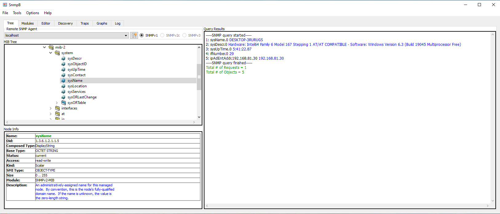

  En vérifaint les différentes valeurs retournées dans le screenshot et les commandes bash fournies après nous avons pu tirer ces conclusions

  1. **SysDescr** : Le MIB `sysDescr` indique que le matériel est un "Intel64 Family 6 Model 167… Windows Version 6.3", ce qui correspond aux caractéristiques générales affichées par `systeminfo`, bien que cette description semble être influencée par la virtualisation VMware.

  2. **SysName** : La commande `hostname` renvoie "DESKTOP-3RURUGS", ce qui correspond bien au `SysName` obtenu via SNMP.

  3. **SysUpTime** : La commande `net stats workstation` montre que le système a démarré le "12.11.2024 à 17:04:43", ce qui est cohérent avec la valeur de `SysUpTime` en SNMP indiquant une durée de fonctionnement de 5 heures (si cette valeur est vérifiée à une heure postérieure).

  4. **ifNumber** : `ifNumber` retourne 25 interfaces, mais en vérifiant avec `netsh interface ipv4 show interfaces`, nous en trouvons que 3. Certaines interfaces virtuelles peuvent être masquées.

  5. **Adresse IP** : La commande `ipconfig` confirme que l’adresse IPv4 de la machine est bien `192.168.81.30`, ce qui correspond à la valeur obtenue via SNMP.

  ```bash
  C:\Users\Tobioo>systeminfo

  Nom de l’hôte:                              DESKTOP-3RURUGS
  Nom du système d’exploitation:              Microsoft Windows 10 Professionnel
  Version du système:                         10.0.19045 N/A build 19045
  Fabricant du système d’exploitation:        Microsoft Corporation
  Configuration du système d’exploitation:    Station de travail autonome
  Type de build du système d’exploitation:    Multiprocessor Free
  Propriétaire enregistré:                    Tobioo
  Organisation enregistrée:
  Identificateur de produit:                  00330-80000-00000-AA344
  Date d’installation originale:              02.10.2024, 21:27:57
  Heure de démarrage du système:              12.11.2024, 17:04:39
  Fabricant du système:                       VMware, Inc.
  Modèle du système:                          VMware Virtual Platform
  Type du système:                            x64-based PC
  Processeur(s):                              2 processeur(s) installé(s).
                                              [01] : Intel64 Family 6 Model 167 Stepping 1 GenuineIntel ~3600 MHz
                                              [02] : Intel64 Family 6 Model 167 Stepping 1 GenuineIntel ~3600 MHz
  Version du BIOS:                            Phoenix Technologies LTD 6.00, 12.11.2020
  Répertoire Windows:                         C:\Windows
  Répertoire système:                         C:\Windows\system32
  Périphérique d’amorçage:                    \Device\HarddiskVolume1
  Option régionale du système:                fr;Français (France)
  Paramètres régionaux d’entrée:              fr-ch;Français (Suisse)
  Fuseau horaire:                             (UTC+01:00) Bruxelles, Copenhague, Madrid, Paris
  Mémoire physique totale:                    2 047 Mo
  Mémoire physique disponible:                703 Mo
  Mémoire virtuelle : taille maximale:        3 409 Mo
  Mémoire virtuelle : disponible:             762 Mo
  Mémoire virtuelle : en cours d’utilisation: 2 647 Mo
  Emplacements des fichiers d’échange:        C:\pagefile.sys
  Domaine:                                    WORKGROUP
  Serveur d’ouverture de session:             \\DESKTOP-3RURUGS
  Correctif(s):                               10 Corrections installées.
                                              [01]: KB5044029
                                              [02]: KB5031988
                                              [03]: KB5011048
                                              [04]: KB5011058
                                              [05]: KB5015684
                                              [06]: KB5043064
                                              [07]: KB5014032
                                              [08]: KB5032907
                                              [09]: KB5043935
                                              [10]: KB5043130
  Carte(s) réseau:                            2 carte(s) réseau installée(s).
                                              [01]: Intel(R) 82574L Gigabit Network Connection
                                                    Nom de la connexion : Ethernet0
                                                    DHCP activé :         Non
                                                    Adresse(s) IP
                                                    [01]: 192.168.81.30
                                                    [02]: fe80::de15:ba2:c80f:5caf
                                              [02]: Bluetooth Device (Personal Area Network)
                                                    Nom de la connexion : Connexion réseau Bluetooth
                                                    État :                Support déconnecté
  Configuration requise pour Hyper-V:         Un hyperviseur a été détecté. Les fonctionnalités nécessaires à Hyper-V ne seront pas affichées.

  C:\Users\Tobioo>hostname
  DESKTOP-3RURUGS

  C:\Users\Tobioo>net stats workstation
  Statistiques de station de \\DESKTOP-3RURUGS


  Statistiques depuis 12.11.2024 17:04:43


    Octets reçus                   0
    Blocs SMB reçus                5
    Octets envoyés                 0
    Blocs SMB envoyés              0
    Lectures                       0
    Écritures                      0
    Refus de lectures brutes       0
    Refus d’écritures brutes       0

    Erreurs réseau                 0
    Connexions établies            0
    Reconnexions                   0
    Déconnexions automatiques      0

    Sessions ouvertes              0
    Sessions bloquées              0
    Échecs de sessions             0
    Échecs d’opérations            0
    Nb. d’utilisations             0
    Nb. d’échecs d’utilisation     0

  La commande s’est terminée correctement.


  C:\Users\Tobioo>Get-NetAdapter -IncludeHidden
  'Get-NetAdapter' n’est pas reconnu en tant que commande interne
  ou externe, un programme exécutable ou un fichier de commandes.

  C:\Users\Tobioo>netsh interface ipv4 show interfaces

  Idx     Mét         MTU          État                Nom
  ---  ----------  ----------  ------------  ---------------------------
    1          75  4294967295  connected     Loopback Pseudo-Interface 1
    3          25        1500  connected     Ethernet0
    4          65        1500  disconnected  Connexion réseau Bluetooth


  C:\Users\Tobioo>ipconfig

  Configuration IP de Windows


  Carte Ethernet Ethernet0 :

    Suffixe DNS propre à la connexion. . . :
    Adresse IPv6 de liaison locale. . . . .: fe80::de15:ba2:c80f:5caf%3
    Adresse IPv4. . . . . . . . . . . . . .: 192.168.81.30
    Masque de sous-réseau. . . . . . . . . : 255.255.255.0
    Passerelle par défaut. . . . . . . . . : 192.168.81.2

  Carte Ethernet Connexion réseau Bluetooth :

    Statut du média. . . . . . . . . . . . : Média déconnecté
    Suffixe DNS propre à la connexion. . . :

  C:\Users\Tobioo>
  ```

- **3.2 Configuration de l'agent SNMP sur le routeur Cisco**

  - **Livrable 3 :** Montrez la configuration du routeur Cisco de manière à ce qu’il puisse être géré via SNMPv2 (choisissez ciscoRO comme community string read-only et ciscoRW comme community string read-write). Configurez également le routeur pour qu’il envoie ses traps SNMP au manager SNMPb sur Windows. Prévoyez la synchro temps et l’affichage des événements en millisecondes.

  Voici la configuration que nous avons fait:

  ```cisco
  enable
  configure terminal
  snmp-server community ciscoRO RO
  snmp-server community ciscoRW RW
  snmp-server host 192.168.150.200 version 2c ciscoRO
  snmp-server enable traps
  ntp server 192.168.150.200
  service timestamps debug datetime msec
  service timestamps log datetime msec

  end
  write memory
  ```  

  - **Livrable 4 :** Montrez les valeurs retournées par les 5 objets SysDescr, SysName, SysUpTime, sysObjectID, ainsi que l’adresse IP de votre cible (obtenue via SNMP).

  Voici les différentes valeurs retournées par les commandes SNMP:

  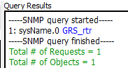
  
  
  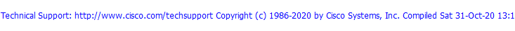
  
  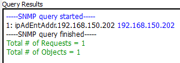

  - **Livrable 5 :** À quoi sert/correspond la valeur retournée par sysObjectID ? Que vous manque-t-il pour l’interpréter correctement ?

  La valeur de `sysObjectID` retournée est `enterprises.9.1.1537`. Cet OID identifie le type de périphérique et permet de l’associer à un modèle spécifique chez le fabricant, ici Cisco. Le préfixe `9` correspond au code attribué à Cisco dans l'arborescence SNMP. Le suffixe `1537` indique plus précisément le modèle, ici correspondant à un **routeur Cisco CSR1000v**.

  Pour interpréter plus en détail cette information, il serait nécessaire d’intégrer le fichier **MIB Cisco** spécifique, comme **CISCO-PRODUCT-MIB**, dans SNMPb. Cela permettrait d’obtenir des informations supplémentaires sur les caractéristiques et la version du modèle associé à cet identifiant.
  
  - **Livrable 6 :** À l’aide de Wireshark, capturez et présentez de manière lisible les trames lorsque la machine Windows 10 interroge le routeur Cisco pour obtenir le nom de l’équipement (les champs concernant SNMP doivent être visibles et commentés).

  **Requête :**

  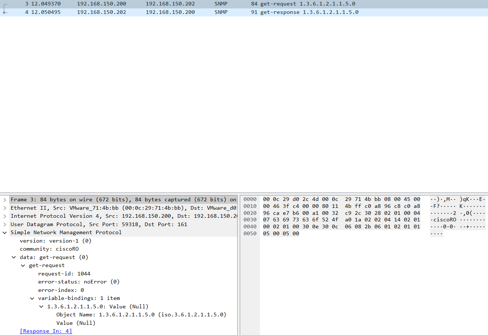

  1. **Version :** `version-1 (0)` – Indique l'utilisation de SNMPv1.
  2. **Community :** `ciscoRO` – Community string utilisé pour l'accès en lecture seule.
  3. **data : get-request** – Type de message `Get-Request` pour demander la valeur d’un OID.
  4. **request-id :** `1044` – Identifiant unique de la requête pour correspondre avec la réponse.
  5. **error-status :** `noError (0)` – Aucun problème dans la requête.
  6. **error-index :** `0` – Aucun index d'erreur car il n'y a pas d'erreur.
  7. **variable-bindings :**
  - **OID :** `1.3.6.1.2.1.1.5.0` – Correspond à `sysName`, l'identifiant pour le nom d'hôte.
  - **Value :** `Null` – Valeur vide, car la requête demande simplement la valeur de cet OID.

  **Réponse :**

  

  1. **Version :** `version-1 (0)` – Utilisation de SNMPv1.
  2. **Community :** `ciscoRO` – Confirme l'accès en lecture seule pour la réponse.
  3. **data : get-response** – Type de message `Get-Response` pour fournir la valeur demandée.
  4. **request-id :** `1044` – Identique à celui de la requête pour correspondre la réponse.
  5. **error-status :** `noError (0)` – Requête traitée sans erreur.
  6. **error-index :** `0` – Aucun index d'erreur.
  7. **variable-bindings :**
  - **OID :** `1.3.6.1.2.1.1.5.0` – OID correspondant à la requête.
  - **Value :** `GRS_rtr` – Nom d'hôte retourné par le routeur, confirmant que le `sysName` est `GRS_rtr`.

  - Changez le nom (hostname) du routeur à l’aide de l’application SNMPb (nouveau nom : router-`<votre-nom>`) tout en capturant avec Wireshark les messages échangés.

  - **Livrable 7 :** Montrez et analysez l’échange de messages capturés par Wireshark.

  **Requête :**

  

  1. **Version :** `version-1 (0)` – Utilisation de SNMPv1.
  2. **Community :** `ciscoRW` – Community string en lecture-écriture, permettant la modification de paramètres.
  3. **data : set-request** – Type de message `Set-Request` pour modifier la valeur de l’OID.
  4. **request-id :** `1045` – Identifiant unique pour cette requête, permettant de l'associer à la réponse.
  5. **error-status :** `noError (0)` – Aucun problème détecté dans la requête.
  6. **error-index :** `0` – Aucun index d’erreur.
  7. **variable-bindings :**
  - **OID :** `1.3.6.1.2.1.1.5.0` – Correspond à `sysName`, l’OID utilisé pour modifier le nom d'hôte.
  - **Value :** `"router-mouti"` – Nouvelle valeur pour le `sysName`, définie comme `router-mouti`.

  **Réponse :**

  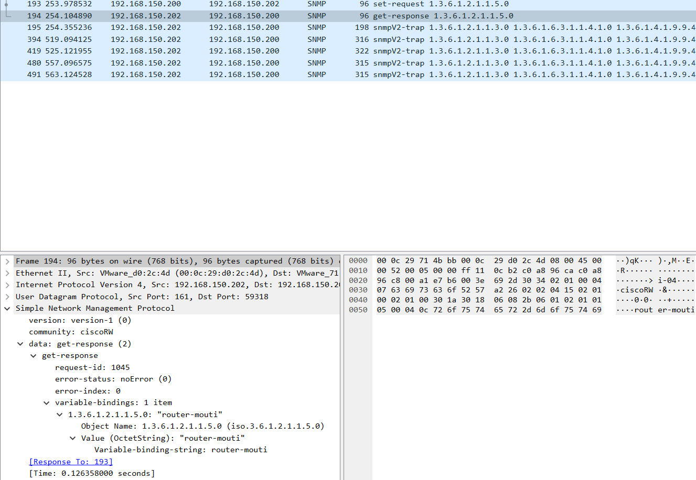

  1. **Version :** `version-1 (0)` – Version SNMP utilisée pour la réponse.
  2. **Community :** `ciscoRW` – Confirme l'utilisation du community string en lecture-écriture.
  3. **data : get-response** – Type de message `Get-Response` confirmant la réception et l'exécution de la requête.
  4. **request-id :** `1045` – Identique à celui de la requête, permettant de lier cette réponse à la demande `Set-Request`.
  5. **error-status :** `noError (0)` – Confirme que la requête a été traitée sans erreur.
  6. **error-index :** `0` – Aucun index d’erreur associé.
  7. **variable-bindings :**
  - **OID :** `1.3.6.1.2.1.1.5.0` – L’OID correspond à `sysName`, indiquant que la requête concernait le changement de nom.
  - **Value :** `"router-mouti"` – Retourne la valeur mise à jour, confirmant que le nom d'hôte du routeur a bien été modifié en `router-mouti`.

  Cette analyse montre le succès de l'opération de changement de nom d'hôte, avec une requête `Set-Request` acceptée et confirmée dans la `Get-Response`.

  - Générez une trap SNMP en déclenchant un événement sur votre routeur et capturez avec Wireshark les messages échangés.

  - **Livrable 8 :** Montrez les messages (traps) reçus par l’application SNMPb.

  Nous avons effectué la commande suivante `test snmp trap config` sur le routeur pour générer une trap SNMP. Voici les messages reçus par l'application SNMPb :

  

  - **Livrable 9 :** Analysez les trames de la capture précédente et décodez la signification des différents messages SNMP en recherchant la signification du « OID code » à l’aide du SNMP Object Navigator Cisco.

  Nous avons généré un trap avec 4 bindings, chacun correspondant à un OID spécifique dans la MIB Cisco. Voici l'analyse des OIDs présents dans le trap et leur signification :

  - **Notification Type (OID)** : Les OIDs des traps se trouvent sous la colonne "Notification Type". En convertissant le préfixe `enterprises` en `1.3.6.1.4.1`, les OIDs complets sont obtenus.

  #### **OID Bindings**

  1. **OID : 1.3.6.1.4.1.9.9.43.1.1.6.1.3**  
    **Nom** : `ccmHistoryEventCommandSource`  
    **Description** : Indique la source de la commande qui a déclenché l'événement.
  - **Valeur possible** :
    - `1` : Commande provenant de la ligne de commande (commandLine).
    - `2` : Commande provenant de SNMP.

  2. **OID : 1.3.6.1.4.1.9.9.43.1.1.6.1.4**  
    **Nom** : `ccmHistoryEventConfigSource`  
    **Description** : La source de la configuration associée à l'événement. Ce champ identifie d'où provient la configuration qui a généré le trap.

  3. **OID : 1.3.6.1.4.1.9.9.43.1.1.6.1.5**  
    **Nom** : `ccmHistoryEventConfigDestination`  
    **Description** : La destination de la configuration de l'événement, indiquant vers où les données de configuration ont été dirigées après l'événement.

  4. **OID : 1.3.6.1.4.1.9.9.43.1.1.6.1.8**  
    **Nom** : `ccmHistoryEventTerminalUser`  
    **Description** : Si la source de la commande (`ccmHistoryEventCommandSource`) est `commandLine`, cet OID affiche le nom de l'utilisateur actuellement connecté.

  - **Livrable 10 :** Montrez la configuration de votre routeur afin qu’il n’accepte des requêtes SNMP que de la part de votre machine Windows uniquement.

  Voici la config :

  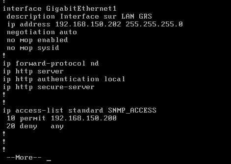

  `ip access-list standard SNMP_ACCESS`

  En appliquant cette configuration sur le routeur, nous limitons les requêtes SNMP aux seules provenances autorisées, renforçant ainsi la sécurité en empêchant tout autre hôte d’accéder au service SNMP.

- **3.3 Configuration de l'agent SNMP sur Ubuntu**

  - **Livrable 11 :**
  - Le fichier de configuration principal pour SNMP sur Ubuntu est **`/etc/snmp/snmpd.conf`**.
  - Nous avons modifié ce fichier pour configurer le community string en mode lecture seule et permettre les connexions externes.

#### Contenu et modifications du fichier `/etc/snmp/snmpd.conf`

- **Adresse d'écoute** : Configuré pour écouter sur toutes les interfaces réseau.

    ```conf
    agentAddress udp:161
    ```

- **Community string** : Défini avec `heig` pour correspondre à la configuration Windows, en mode lecture seule.

    ```conf
    rocommunity heig
    ```

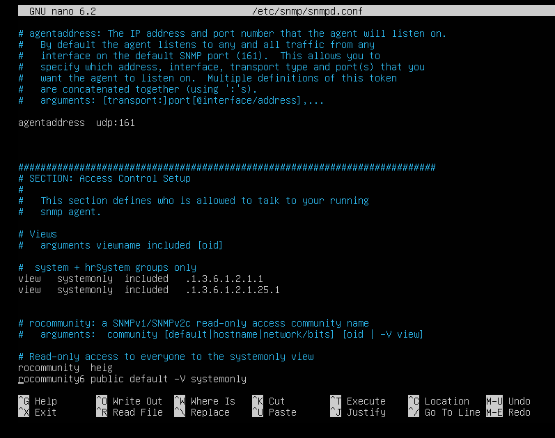

Ces paramètres permettent au nœud Ubuntu de répondre aux requêtes SNMP provenant de n’importe quel hôte avec le community string `heig`, en mode lecture seule.

- **Livrable 12 :** Montrez le résultat dans SNMPb d’une requête permettant de connaître la durée de fonctionnement de votre nœud Linux.

- Depuis SNMPb sur Windows, nous avons interrogé le nœud Ubuntu pour obtenir la durée de fonctionnement (SysUpTime).
- L’OID utilisé est **`1.3.6.1.2.1.1.3`**, qui retourne le temps écoulé depuis le dernier démarrage du système.

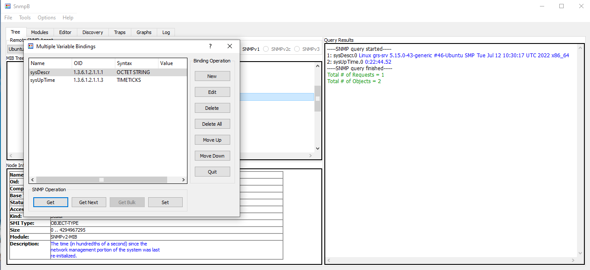

La capture d'écran montre la durée de fonctionnement de la machine Ubuntu, récupérée avec succès via SNMPb en utilisant le community string `heig`.

- **3.4 Windows PowerShell**
  
  - **Livrable 13 :** Montrez la commande (par exemple via l’installation du module SNMP) utilisée depuis Windows pour récupérer le nom de votre routeur Cisco.
  
  On installe Net-SNMP pour windows.
  
  Ensuite, on peut faire cette commande pour récupérer le nom du routeur:
  
  

  On voit bien router-mouti donc c'est good.

  - **Livrable 14 :** Montrez la commande ou le script utilisé pour récupérer toutes les minutes la liste des processus/programmes actifs sur votre machine Windows.

  Voici le script utilisé :

  ```PowerShell
  # Paramètres
  $community = "heig"
  $targetIP = "127.0.0.1"  # Adresse IP de la machine Windows
  $oidProcesses = "1.3.6.1.2.1.25.4.2.1.2"  # hrSWRunName

  # Boucle infinie pour récupérer les processus toutes les minutes
  while ($true) {
      # Exécuter la commande snmpwalk pour obtenir la liste des processus
      $result = snmpwalk -v2c -c $community $targetIP $oidProcesses

      # Afficher le résultat
      Write-Host "Liste des processus actifs à $(Get-Date):"
      Write-Host $result

      # Attendre 60 secondes avant la prochaine exécution
      Start-Sleep -Seconds 60
  }
  ```

---

### Objectif 4 : MIBs privées

- **4.1 Intégration des MIBs privées pour le routeur Cisco**

  - **Livrable 15 :** Donnez la liste des fichiers MIBs que vous avez chargés et expliquez comment vous avez déterminé ce choix.

  On a chargé:
  CISCO-FLASH-MIB
  CISCO-SMI
  CISCO-QOS-PIB-MIB

  Tout d'abord, on a demandé à ChatGPT quelle MIB était nécessaire pour demander des informations sur la mémoire flash embarquée sur un routeur cisco csr1000v et il a répondu CISCO-FLASH-MIB. Ensuite, on la^'a chargé et en vérifiant la syntaxe du MIB, on voit qu'il y a des erreurs car il lui faut CISCO-SMI et CISCO-QOS-PIB-MIB.
  
  - **Livrable 16 :** Montrez, via une requête SNMPb, le nom des 10 premiers fichiers stockés sur la mémoire flash de votre routeur Cisco.

  voici la liste des noms :

  

---

### Objectif 5 : Configuration des agents SNMP en mode v3

- **5.1 Configuration de SNMPv3 sur le routeur Cisco**
  
  - **Livrable 17 :** Montrez la configuration de votre router afin qu’il n’accepte plus que des requêtes SNMPv3 en mode authentifié et chiffré.

  Nous avons d'abord enlevé la config v2:

  ```cisco
  no snmp-server community ciscoRO
  no snmp-server community ciscoRW
  no snmp-server host 192.168.150.200 version 2c ciscoRO
  ```

  Ensuite on peut faire la config v3:

  ```plaintext
  ! Créer un groupe SNMPv3 avec des droits en lecture seule
  snmp-server group v3group v3 priv

  ! Créer un utilisateur avec authentification et chiffrement
  snmp-server user v3user v3group v3 auth sha authpwd priv aes 128 privpwd
  ```

  - **Livrable 18 :** Montrez la configuration en mode SNMPv3 de votre application SNMPb et montrez le résultat d’une requête sur la valeur SysUpTime (MIB-2) en SNMPv3.

  Configuration de l'agent :

  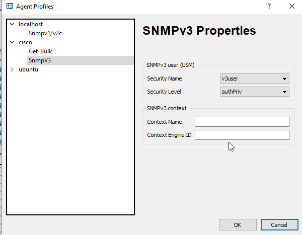

  Configuration du profil user :

  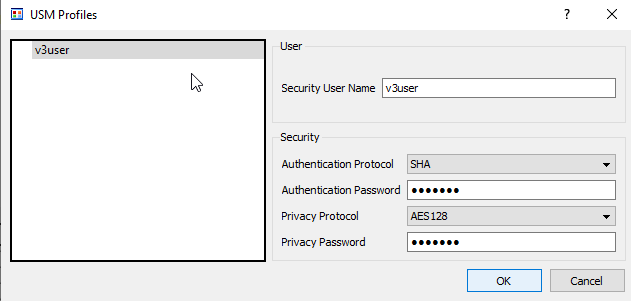

  Requête SNMPv3 pour obtenir la valeur de `sysUpTime` :
  
  
  - **Livrable 19 :** Capturez/analysez les messages lors d’une requête SNMP v3.

  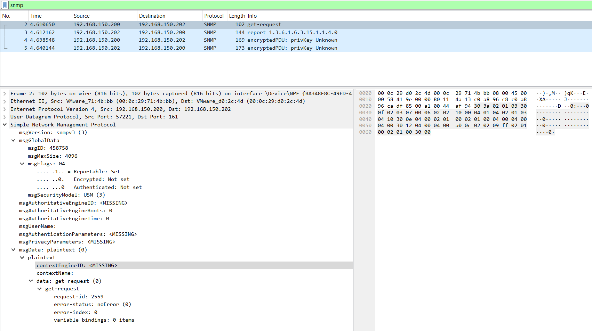

  1. **Version SNMP** : La version est SNMPv3, qui ajoute des fonctionnalités de sécurité comme l'authentification et le chiffrement.

  2. **Identifiants Globaux** :
     - `msgID` : 458758, identifiant unique de cette requête.
     - `msgMaxSize` : 4096, taille maximale de message que l’agent peut traiter.
     - `msgFlags` : 04, indiquant que le message est "reportable" mais sans chiffrement et sans authentification (ici en mode "noAuthNoPriv").
     - `msgSecurityModel` : USM (User-based Security Model), modèle de sécurité utilisé pour gérer les utilisateurs.
  3. **Données de Sécurité** :
     - `msgAuthoritativeEngineID` et autres champs de sécurité (`msgUserName`, `msgAuthenticationParameters`, `msgPrivacyParameters`) sont marqués comme `<MISSING>`, car ce message n'est pas authentifié ni chiffré.
  4. **Contenu des données** :
     - **Data (get-request)** : Requête de type Get-Request avec `request-id` 2559, `error-status` 0 (aucune erreur), et `error-index` 0. Le champ `variable-bindings` est vide, donc aucun OID n'est demandé ici.

  

  1. **Version SNMP** : Toujours en version 3.
  2. **Identifiants Globaux** :
      - `msgID` : 458758, le même identifiant que la requête pour correspondre à cette transaction.
      - `msgMaxSize` : 1500, taille maximale que le périphérique peut renvoyer.
      - `msgFlags` : 00, indiquant qu’il s’agit d’un message de rapport sans chiffrement ni authentification (en mode "noAuthNoPriv").
      - `msgSecurityModel` : USM, modèle de sécurité basé sur l'utilisateur.
  3. **Données de Sécurité** :
      - `msgAuthoritativeEngineID` : Contient l’Engine ID de l’agent SNMP, identifiant unique du moteur de sécurité du périphérique cible.
      - `msgUserName`, `msgAuthenticationParameters`, et `msgPrivacyParameters` : `<MISSING>`, car aucune authentification ou confidentialité n'est configurée ici.
  4. **Contenu des données** :
      - **Data (report)** : Message de rapport en réponse à la demande de l'image précédente. Il peut signaler une erreur ou un état particulier, mais les `variable-bindings` ne contiennent aucune donnée significative.

  

  1. **Version SNMP** : Toujours version 3.
  2. **Identifiants Globaux** :
      - `msgID` : 458759, un nouvel identifiant pour cette requête.
      - `msgMaxSize` : 4096, taille maximale de message possible.
      - `msgFlags` : 07, indiquant que le message est "reportable" et activé en mode `authPriv`, donc authentifié et chiffré.
      - `msgSecurityModel` : USM, pour une gestion basée sur les utilisateurs.
  3. **Données de Sécurité** :
      - `msgAuthoritativeEngineID` : Identifiant unique du moteur de sécurité de l’agent.
      - `msgUserName` : v3user, nom de l'utilisateur configuré pour cette session.
      - `msgAuthenticationParameters` : Paramètres d'authentification (hachage) pour confirmer l’identité de l'utilisateur.
      - `msgPrivacyParameters` : Paramètres de confidentialité pour le chiffrement de la requête.
  4. **Contenu des données** :
      - **Encrypted PDU** : La requête est chiffrée, donc le contenu est protégé et illisible sans déchiffrement.

  

  1. **Version SNMP** : Toujours version 3.
  2. **Identifiants Globaux** :
      - `msgID` : 458759, le même identifiant que la requête correspondante.
      - `msgMaxSize` : 1500, taille maximale que l’agent peut traiter.
      - `msgFlags` : 03, ce qui indique que la réponse est uniquement authentifiée (`authNoPriv`) mais non chiffrée.
      - `msgSecurityModel` : USM.
  3. **Données de Sécurité** :
      - `msgAuthoritativeEngineID` : Identifiant unique du moteur de sécurité de l’agent.
      - `msgUserName` : v3user.
      - `msgAuthenticationParameters` : Paramètres d'authentification utilisés pour la validation.
      - `msgPrivacyParameters` : `<MISSING>`, car aucune confidentialité n'est appliquée dans cette réponse.
  4. **Contenu des données** :
      - **Encrypted PDU** : La réponse contient la donnée demandée mais est sécurisée, donc non visible en clair ici.

  Dans cet échange, nous avons :
  Une première requête sans sécurité (Image 1), suivie d'un message de rapport indiquant la nécessité d'utiliser l'authentification et le chiffrement.
  Ensuite, une requête chiffrée et authentifiée (Image 3), indiquant que les paramètres de sécurité `authPriv` sont maintenant activés, conformément à la configuration SNMPv3.
  La réponse est authentifiée mais non chiffrée (Image 4), démontrant que le périphérique peut répondre avec `authNoPriv` pour ce type de message.

- **Livrable 20 :** Quelle(s) bonne(s) pratique(s) supplémentaires suggérez-vous pour sécuriser votre trafic SNMP v3 ?
  
  - Utiliser des mots de passe forts pour l'authentification et le chiffrement.
  - Restreindre l'accès par adresse IP (via ACL).
  - Limiter les droits d’accès en utilisant des groupes et utilisateurs avec permissions restreintes.
  - Activer la journalisation pour surveiller et auditer les accès SNMP.
  - Désactiver les versions SNMP antérieures (v1 et v2c).
  - Segmenter le réseau de gestion (VLAN dédié).

---

### Objectif 6 : Utilisation de WMI

- **6.1 Vérification du service WMI**
  - **Livrable 21 :** À l’aide de WMI explorer, retrouver les caractéristiques du processeur de votre VM Windows ainsi que le SID de votre utilisateur local.

  Voici les captures d'écran:

  **CPU :**

  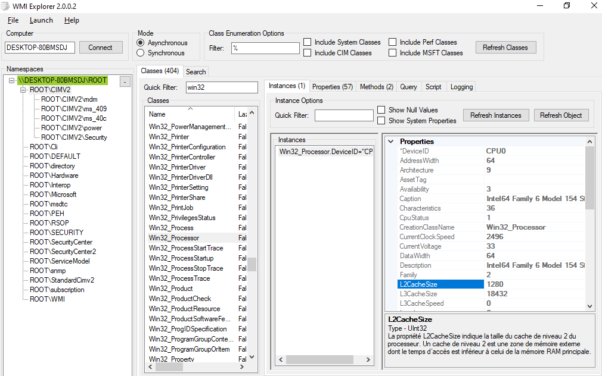

  **SID :**

  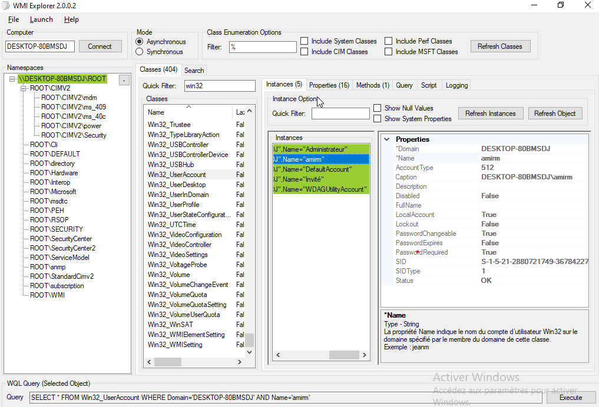 

- **6.2 Surveillance des partitions de disque avec un script WMI**
  - **Livrable 22 :** Montrez votre script permettant de lister les partitions de la VM Windows avec leur lettre de lecteur et de retourner le pourcentage d’espace libre. En cas d’espace insuffisant, une alarme Syslog est générée et récupérée sur votre serveur Syslog.

  Voici le script que nous avons fait :

  Etant donné que nous avons un espace libre d'environ 61% nous avons défini le treshold pour la démonstration à 70%, mais en temps normal nous devrions le mettre plus bas. (Je n'allais pas remplir mon disque C inutilement pour la démonstration)
  
  ```PowerShell
  # Import du module nécessaire pour l'envoi des messages Syslog
  Import-Module -Name Posh-SYSLOG -ErrorAction Stop

  # Définition du seuil d'alerte pour l'espace libre en pourcentage
  $threshold = 70

  # Obtenir la liste des partitions locales
  $partitions = Get-WmiObject -Class Win32_LogicalDisk -Filter "DriveType=3" | Select-Object DeviceID, FreeSpace, Size

  # Parcourir chaque partition pour calculer l'espace libre et envoyer une alerte si nécessaire
  foreach ($partition in $partitions) {
      $partitionSizeGB = [math]::Round($partition.Size / 1GB, 2)
      $freeSpaceGB = [math]::Round($partition.FreeSpace / 1GB, 2)
      
      if ($partitionSizeGB -gt 0) {
          $freeSpacePercent = [math]::Round(($freeSpaceGB / $partitionSizeGB) * 100, 2)
          
          # Afficher les informations de la partition
          Write-Output "Partition: $($partition.DeviceID), Espace libre: $freeSpaceGB GB, Taille totale: $partitionSizeGB GB, Pourcentage libre: $freeSpacePercent%"
          
          # Vérifier si le pourcentage d'espace libre est inférieur au seuil
          if ($freeSpacePercent -lt $threshold) {
              # Générer le message d'alerte Syslog
              $syslogMessage = "Alerte: La partition $($partition.DeviceID) a moins de $threshold% d'espace libre ($freeSpacePercent%)."
              Write-Output $syslogMessage
              
              # Paramètres du serveur Syslog
              $syslogParams = @{
                  Server = "127.0.0.1"
                  Port = 514
                  Facility = 21
                  Severity = 4
                  Message = $syslogMessage
              }

              # Envoyer l'alerte au serveur Syslog
              Send-SyslogMessage @syslogParams
          }
      }
  }
  ```

  - **Livrable 23 :** Montrez le résultat (valeurs obtenues et message Syslog reçu).

  Voici le résulat obtenu dans la console :

  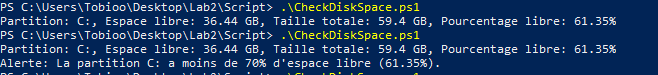

  On voit l'exécution du script avant de connaître l'espace libre puis le résultat lorsque nous avons modifié la valeur du treshold pour que l'alerte soit déclenchée.

  Voici le message syslog reçu :

  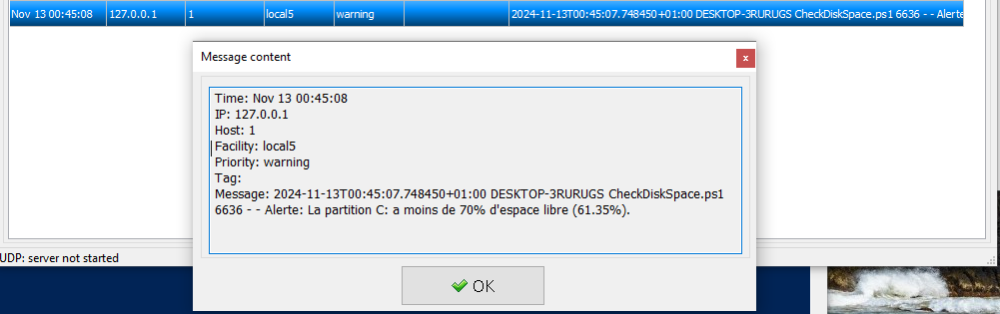

- **6.3 Détection des périphériques USB avec WMI**
  - **Livrable 24 :** Montrez votre commande pour établir une souscription permanente à un événement lorsqu’un périphérique USB est inséré dans votre système.

  Nous avons tenté de faire cela mais nous n'avions pas quelque chose de concluant, nous avons donc décidé de ne pas le mettre dans le rapport.
  
  - **Livrable 25 :** Montrez l’événement reçu dans l’observateur d’événements.

    Nous avons tenté de faire cela mais nous n'avions pas quelque chose de concluant, nous avons donc décidé de ne pas le mettre dans le rapport.
